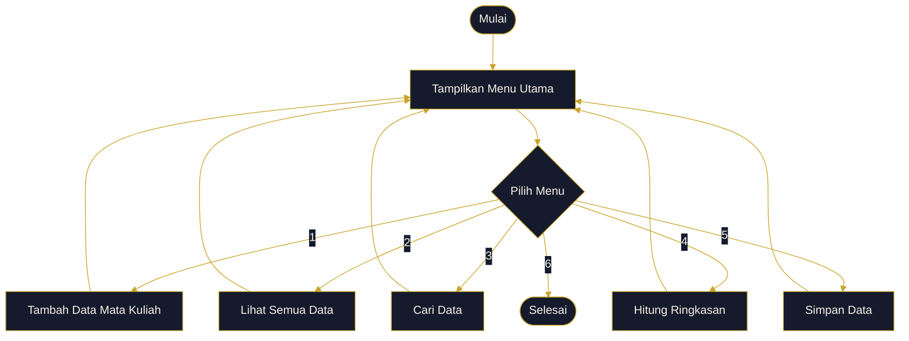
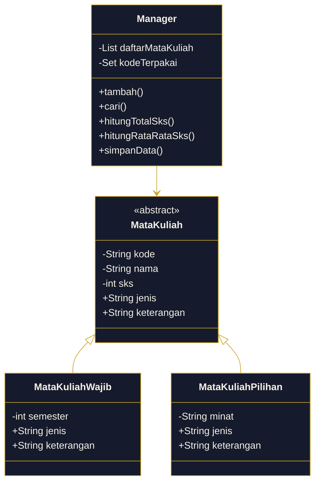
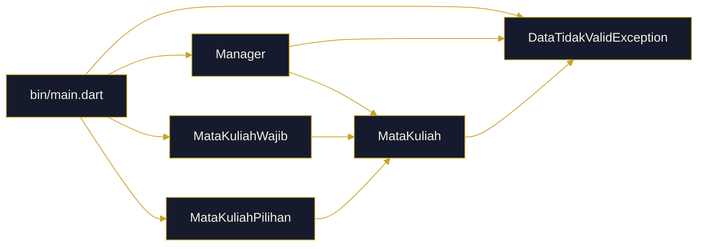

<div align="center">

# Sistem Akademik

*UAS Pemrograman Berorientasi Objek — Aplikasi CLI Dart*

[](https://dart.dev)
[](#)
[](#)

<sub>[01. Identitas](#01-identitas) · [02. Ringkasan](#02-ringkasan) · [03. Fitur](#03-fitur) · [04. Konsep OOP](#04-konsep-oop-yang-diterapkan) · [05. Arsitektur](#05-arsitektur) · [06. Struktur Proyek](#06-struktur-proyek) · [07. Preview Terminal](#07-preview-terminal) · [08. Menjalankan Proyek](#08-menjalankan-proyek)</sub>

</div>

<br>

## 01. Identitas

<table>
<tr><td width="140"><b>Nama</b></td><td>Muhammad Alwi Nidzam</td></tr>
<tr><td><b>NIM</b></td><td>251240001589</td></tr>
<tr><td><b>Mata Kuliah</b></td><td>PBO (Pemrograman Berorientasi Objek)</td></tr>
<tr><td><b>Tema</b></td><td>Sistem Akademik</td></tr>
<tr><td><b>Tipe</b></td><td>Command Line Interface</td></tr>
</table>

<br>

## 02. Ringkasan

> Project ini dibuat untuk tugas UAS Pemrograman Berorientasi Objek. Aplikasi ini membantu mengelola data mata kuliah — mulai dari menambah data, melihat daftar, mencari data, sampai menghitung ringkasan SKS.
>
> Struktur program dibuat dengan pendekatan OOP supaya kode lebih rapi, mudah dipahami, dan setiap class memiliki tanggung jawab yang jelas.

<br>

## 03. Fitur

| Fitur | Deskripsi |
|:--|:--|
| Tambah Data | Menambahkan mata kuliah wajib atau mata kuliah pilihan. |
| Lihat Data | Menampilkan daftar mata kuliah dalam format tabel terminal. |
| Cari Data | Mencari mata kuliah berdasarkan kode, nama, atau jenis. |
| Hitung Total | Menghitung total data, total SKS, rata-rata SKS, dan ringkasan jenis. |
| Simpan Data | Mensimulasikan proses penyimpanan menggunakan `async` dan `await`. |
| Validasi Input | Menampilkan pesan error ketika input tidak sesuai. |

<br>

## 04. Konsep OOP yang Diterapkan

| Konsep | Implementasi |
|:--|:--|
| Class & Object | `MataKuliah`, `MataKuliahWajib`, `MataKuliahPilihan`, `Manager` |
| Encapsulation | Field private, getter, setter, dan validasi data |
| Inheritance | `MataKuliahWajib` dan `MataKuliahPilihan` mewarisi `MataKuliah` |
| Polymorphism | Getter `keterangan` dioverride pada class turunan |
| Abstraction | `MataKuliah` dibuat sebagai abstract class |
| Exception Handling | `DataTidakValidException` untuk menangani data tidak valid |
| Collection | `List`, `Set`, dan `Map` |
| Higher-Order Function | `where()`, `fold()`, `map()`, `forEach()` |
| Async/Await | Method `simpanData()` berjalan secara asynchronous |

<br>

## 05. Arsitektur

**Alur Program**



**Class Diagram**



<br>

## 06. Struktur Proyek

File di `bin/` menjadi pintu masuk aplikasi, sedangkan semua logic utama disimpan di `lib/`.

| Layer | Fokus | Isi Utama |
|:--|:--|:--|
| `bin/` | Entry Point | Menjalankan program, menampilkan menu, membaca input terminal |
| `lib/controllers/` | Data Control | Mengatur tambah data, pencarian, total SKS, dan proses simpan |
| `lib/models/` | Data Model | Menyimpan bentuk object mata kuliah wajib dan pilihan |
| `lib/exceptions/` | Error Handling | Menangani input atau data yang tidak valid |

```text
UAS/
├── bin/
│   ├── main.dart                             # Menu utama, input user, output terminal
│   └── uas.dart                              # Launcher alternatif menuju main.dart
│
├── lib/
│   ├── controllers/
│   │   └── manager.dart                      # Mengelola koleksi data mata kuliah
│   │
│   ├── exceptions/
│   │   └── data_tidak_valid_exception.dart   # Custom exception untuk validasi
│   │
│   └── models/
│       ├── mata_kuliah.dart                  # Abstract class sebagai parent model
│       ├── mata_kuliah_pilihan.dart          # Model mata kuliah pilihan
│       └── mata_kuliah_wajib.dart            # Model mata kuliah wajib
│
└── README.md
```

### Peran Tiap File

| File | Peran | Detail |
|:--|:--|:--|
| `bin/main.dart` | Main Program | Mengatur menu, input user, tampilan tabel, pencarian, total data, dan simulasi simpan data |
| `bin/uas.dart` | Alternative Runner | Menjalankan `main.dart` lewat file runner yang lebih pendek |
| `lib/controllers/manager.dart` | Controller | Menyimpan daftar mata kuliah, mencegah kode duplikat, mencari data, menghitung total SKS, rata-rata SKS, dan ringkasan jenis |
| `lib/models/mata_kuliah.dart` | Base Model | Abstract class berisi property umum: kode, nama, SKS, jenis, keterangan |
| `lib/models/mata_kuliah_wajib.dart` | Child Model | Turunan `MataKuliah` untuk mata kuliah wajib, tambahan data semester |
| `lib/models/mata_kuliah_pilihan.dart` | Child Model | Turunan `MataKuliah` untuk mata kuliah pilihan, tambahan data bidang minat |
| `lib/exceptions/data_tidak_valid_exception.dart` | Custom Error | Exception buatan sendiri untuk pesan validasi yang lebih jelas |

### Alur Dependensi



<br>

## 07. Preview Terminal

```text
============================================================================
                              SISTEM AKADEMIK
============================================================================
1. Tambah data
2. Lihat semua data
3. Cari data
4. Hitung total
5. Simpan data
6. Keluar
----------------------------------------------------------------------------
Pilih menu        :
```

<br>

## 08. Menjalankan Proyek

Pastikan Dart SDK sudah terinstall, lalu masuk ke folder `UAS`.

```bash
dart bin/main.dart
```

Alternatif:

```bash
dart bin/uas.dart
```

<br>

---

<div align="center">
<sub>MUHAMMAD ALWI NIDZAM &nbsp;·&nbsp; UAS PEMROGRAMAN BERORIENTASI OBJEK</sub>
</div>
