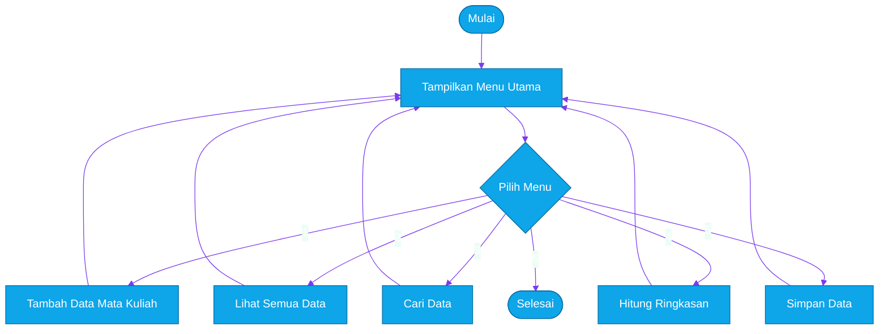
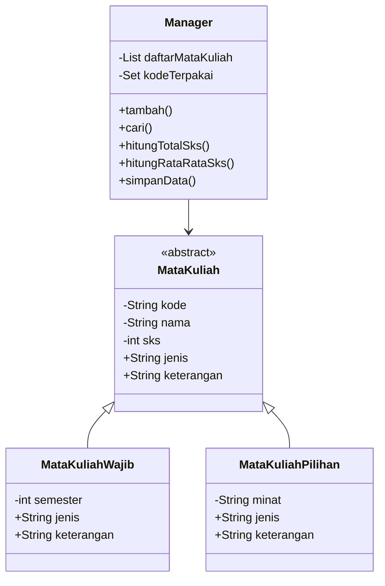

<div align="center">


<br>

<br><br>

<b>Aplikasi terminal untuk mengelola data mata kuliah dengan konsep Pemrograman Berorientasi Objek di Dart.</b>

</div>

---

## Project Profile

<table>
  <tr>
    <td width="50%" valign="top">
      <h3>Identitas</h3>
      <table>
        <tr>
          <td><b>Nama</b></td>
          <td>Muhammad Alwi Nidzam</td>
        </tr>
        <tr>
          <td><b>NIM</b></td>
          <td>251240001589</td>
        </tr>
        <tr>
          <td><b>Mata Kuliah</b></td>
          <td>PBO (Pemrograman Berorientasi Object)</td>
        </tr>
        <tr>
          <td><b>Tema</b></td>
          <td>Sistem Akademik</td>
        </tr>
        <tr>
          <td><b>Tipe</b></td>
          <td>Command Line Interface</td>
        </tr>
      </table>
    </td>
    <td width="50%" valign="top">
      <h3>Ringkasan</h3>
      <p>
        Project ini dibuat untuk tugas UAS Pemrograman Berorientasi Objek.
        Aplikasi ini membantu mengelola data mata kuliah, mulai dari menambah
        data, melihat daftar, mencari data, sampai menghitung ringkasan SKS.
      </p>
      <p>
        Struktur program dibuat dengan pendekatan OOP supaya kode lebih rapi,
        mudah dipahami, dan setiap class memiliki tanggung jawab yang jelas.
      </p>
    </td>
  </tr>
</table>

## Feature Showcase

| Fitur | Deskripsi | Status |
| --- | --- | --- |
| Tambah Data | Menambahkan mata kuliah wajib atau mata kuliah pilihan. | Ready |
| Lihat Data | Menampilkan daftar mata kuliah dalam format tabel terminal. | Ready |
| Cari Data | Mencari mata kuliah berdasarkan kode, nama, atau jenis. | Ready |
| Hitung Total | Menghitung total data, total SKS, rata-rata SKS, dan ringkasan jenis. | Ready |
| Simpan Data | Mensimulasikan proses penyimpanan menggunakan `async` dan `await`. | Ready |
| Validasi Input | Menampilkan pesan error ketika input tidak sesuai. | Ready |

## OOP Concepts

| Konsep | Implementasi |
| --- | --- |
| Class dan Object | `MataKuliah`, `MataKuliahWajib`, `MataKuliahPilihan`, dan `Manager`. |
| Encapsulation | Field private, getter, setter, dan validasi data. |
| Inheritance | `MataKuliahWajib` dan `MataKuliahPilihan` mewarisi `MataKuliah`. |
| Polymorphism | Getter `keterangan` dioverride pada class turunan. |
| Abstraction | `MataKuliah` dibuat sebagai abstract class. |
| Exception | Menggunakan `DataTidakValidException` untuk menangani data tidak valid. |
| Collection | Menggunakan `List`, `Set`, dan `Map`. |
| Higher-Order Function | Menggunakan `where()`, `fold()`, `map()`, dan `forEach()`. |
| Async/Await | Method `simpanData()` berjalan secara asynchronous. |

## Program Flow



## Class Map



## Terminal Preview

```text
============================================================================
                              SISTEM AKADEMIK
============================================================================
1. Tambah data
2. Lihat semua data
3. Cari data
4. Hitung total
5. Simpan data
6. Keluar
----------------------------------------------------------------------------
Pilih menu        :
```

<details>
<summary><b>Struktur Folder</b></summary>

```text
UAS/
|-- bin/
|   |-- main.dart
|   `-- uas.dart
|-- lib/
|   |-- controllers/
|   |   `-- manager.dart
|   |-- exceptions/
|   |   `-- data_tidak_valid_exception.dart
|   `-- models/
|       |-- mata_kuliah.dart
|       |-- mata_kuliah_pilihan.dart
|       `-- mata_kuliah_wajib.dart
`-- README.md
```

</details>

## Run Project

Pastikan Dart SDK sudah terinstall, lalu masuk ke folder `UAS`.

```bash
dart bin/main.dart
```

Alternatif:

```bash
dart bin/uas.dart
```

## Final Notes

<div align="center">

<b>Created by Muhammad Alwi Nidzam</b><br>
UAS Pemrograman Berorientasi Objek

<br><br>


</div>
