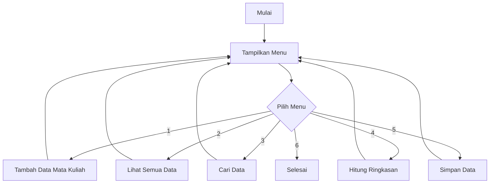

<div align="center">

# UAS OOP Dart

### Sistem Akademik Berbasis CLI

Aplikasi terminal sederhana untuk mengelola data mata kuliah dengan konsep Object-Oriented Programming di Dart.

<br>


</div>

---

## Identitas

| Data | Keterangan |
| --- | --- |
| Nama | Muhammad Alwi Nidzam |
| NIM | 251240001589 |
| Tema | Sistem Akademik |
| Bahasa | Dart |
| Tipe Aplikasi | Command Line Interface |

## Ringkasan Project

Project ini dibuat untuk tugas UAS Pemrograman Berorientasi Objek. Aplikasi ini membantu mengelola data mata kuliah, mulai dari menambah data, melihat daftar mata kuliah, mencari data, sampai menghitung ringkasan SKS.

Program dibuat dengan pendekatan OOP supaya struktur kode lebih rapi, mudah dibaca, dan setiap class memiliki tanggung jawab yang jelas.

## Fitur Utama

| Fitur | Deskripsi |
| --- | --- |
| Tambah Data | Menambahkan mata kuliah wajib atau mata kuliah pilihan. |
| Lihat Data | Menampilkan seluruh daftar mata kuliah dalam format tabel terminal. |
| Cari Data | Mencari mata kuliah berdasarkan kode, nama, atau jenis. |
| Hitung Total | Menghitung jumlah mata kuliah, total SKS, rata-rata SKS, dan ringkasan jenis. |
| Simpan Data | Mensimulasikan proses penyimpanan data menggunakan `async` dan `await`. |
| Validasi Input | Menampilkan pesan error ketika input tidak sesuai. |

## Konsep OOP yang Digunakan

| Konsep | Implementasi |
| --- | --- |
| Class dan Object | `MataKuliah`, `MataKuliahWajib`, `MataKuliahPilihan`, dan `Manager`. |
| Encapsulation | Field private, getter, setter, dan validasi data. |
| Inheritance | `MataKuliahWajib` dan `MataKuliahPilihan` mewarisi `MataKuliah`. |
| Polymorphism | Getter `keterangan` dioverride pada class turunan. |
| Abstraction | `MataKuliah` dibuat sebagai abstract class. |
| Exception | Menggunakan `DataTidakValidException` untuk menangani data tidak valid. |
| Collection | Menggunakan `List`, `Set`, dan `Map`. |
| Higher-Order Function | Menggunakan `where()`, `fold()`, `map()`, dan `forEach()`. |
| Async/Await | Method `simpanData()` berjalan secara asynchronous. |

## Alur Program



## Struktur Folder

```text
UAS/
|-- bin/
|   |-- main.dart
|   `-- uas.dart
|-- lib/
|   |-- controllers/
|   |   `-- manager.dart
|   |-- exceptions/
|   |   `-- data_tidak_valid_exception.dart
|   `-- models/
|       |-- mata_kuliah.dart
|       |-- mata_kuliah_pilihan.dart
|       `-- mata_kuliah_wajib.dart
`-- README.md
```

## Preview Menu

```text
============================================================================
                              SISTEM AKADEMIK
============================================================================
1. Tambah data
2. Lihat semua data
3. Cari data
4. Hitung total
5. Simpan data
6. Keluar
----------------------------------------------------------------------------
Pilih menu        :
```

## Cara Menjalankan Program

Pastikan Dart SDK sudah terinstall, lalu masuk ke folder `UAS` dan jalankan:

```bash
dart bin/main.dart
```

Alternatif:

```bash
dart bin/uas.dart
```

## Author

<div align="center">

**Muhammad Alwi Nidzam**<br>
UAS Pemrograman Berorientasi Objek

</div>
